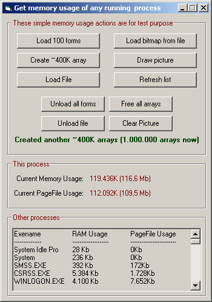



## Get process memory usage

### Description

An example to get process memory usage. You can get *any* process's RAM usage and Page File usage (via exename)

This project also includes some code to use more memory for demonstration like creating arrays, creating forms, loading files into memory and drawing pictures.
 
### More Info
 

             |
---                |---
**Submitted On**   |2006-04-02 02:43:50
**By**             |[Roni Tovi](https://github.com/Planet-Source-Code/PSCIndex/blob/master/ByAuthor/roni-tovi.md)
**Level**          |Advanced
**User Rating**    |4.5 (18 globes from 4 users)
**Compatibility**  |VB 5\.0, VB 6\.0
**Category**       |[Miscellaneous](https://github.com/Planet-Source-Code/PSCIndex/blob/master/ByCategory/miscellaneous__1-1.md)
**World**          |[Visual Basic](https://github.com/Planet-Source-Code/PSCIndex/blob/master/ByWorld/visual-basic.md)
**Archive File**   |[Get\_proces198451412006\.zip](https://github.com/Planet-Source-Code/roni-tovi-get-process-memory-usage__1-64872/archive/master.zip)

